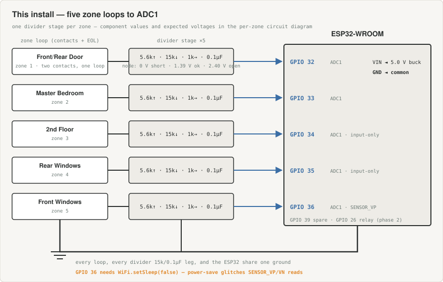
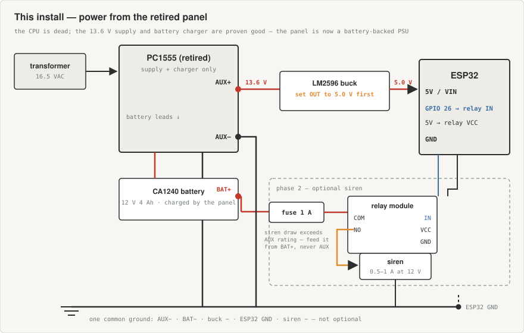

# DIY zone reader — replicating Konnected with your own ESP32

**This is now the active path.** `panel-bringup.md` concluded on 2026-09-14 that the
PC1555's CPU does not execute firmware (see "Final test session"). The panel is retired
as a controller and this design replaces it.

---

## This installation, concretely (design review 2026-09-14)

The generic design below, specialized to what the bring-up actually proved:

### Zone → pin map

| Zone | Label (from keypad card) | GPIO | Notes |
|---|---|---|---|
| 1 | Front Door / Rear Door | 32 | Two contacts, one loop |
| 2 | Master Bedroom | 33 | |
| 3 | 2nd Floor | 34 | Input-only pin — fine |
| 4 | Rear Windows | 35 | Input-only pin — fine |
| 5 | Front Windows | 36 | `SENSOR_VP` — see WiFi note in step 3 |
| — | spare | 39 | Unwired, available |

**All five zones are passive contacts — this system has no PIRs** (AUX was found
empty). The 12 V-for-motion-detectors requirement in step 4 does not apply here; skip
the 12 V adapter entirely.



### Where the wires land

The loops move **off** the panel's `Z1–Z5`/`COM` terminals entirely — the panel keeps
only AC, battery, and AUX+/AUX−. Its zone inputs have their own internal pull-up
network which, even with the CPU dead, still loads the loop and would shift the divider
voltages; a loop gets exactly one owner. Per zone: label the pair at the panel terminal
(the position is the zone map), unscrew it, land one conductor on that zone's divider
node at the perfboard screw terminal and the other on the perfboard ground rail. The
house wiring never leaves the cabinet — the perfboard mounts beside the panel, and its
ground rail ties to buck − / AUX−. Zone 1's two series contacts arrive as one pair like
any other zone. (Panel `COM` is electrically the same node as AUX−, but land returns on
the perfboard anyway — keep all sensing in one place.)

### Power: the dead panel is a working battery-backed PSU

The panel's supply is proven good (13.6 V) and it charges the new CA1240. Use it:

```
Panel AUX+ ──► LM2596 buck (SET TO 5.0 V FIRST) ──► ESP32 VIN
Panel AUX− ──► buck GND ──► ESP32 GND
```

Meter AUX+ to AUX− first (expect ~13.6 V, same rail as the Keybus RED that was
measured). ESP32 + WiFi peaks ~0.25 A at the AUX side — well inside the AUX rating.
Result: zones and ESP32 ride through power cuts on the panel battery. (The router/HA
box won't, unless they have their own UPS — see "What you give up".)



(The generic power diagram in step 4, with the 12 V adapter and PIRs, does not apply
to this house — this one replaces it.)

### Unverified design input — do this first

**Stage 1b (zone loop resistance) was never actually run.** The circuit below assumes
DSC-standard 5.6 kΩ EOL resistors; nothing has confirmed that. Before buying or
building anything: panel fully powered down, meter each loop at the panel end (P3,
20 kΩ range), record the closed value and verify it goes `OL` (or jumps) when the
door opens. The measurement log template in `panel-bringup.md` has a table for it.
If loops read ~0 Ω closed, use the digital-input variant in step 2 instead.

### Siren (optional, phase 2)

The PC1555 AUX output is rated ~550 mA; a siren pulls 0.5–1 A. If the bell is ever
reconnected, feed the relay's 12 V side **from the battery terminals through an inline
1 A fuse**, not from AUX. The panel's own BELL output is CPU-driven and therefore dead.

### Firmware: decided — the repo's own targets, adapted

The `serial` and `web` targets now read the zone loops directly (`include/zones.h`,
`src/zones.cpp`, `src/zone_serial.cpp`, `src/zone_web.cpp`), keeping the repo's
no-broker, no-HA, self-hosted goal. Thresholds live in `zones.h` and must be checked
against the Stage 1b bench measurements. Step 6 below (ESPHome/Konnected) remains the
alternative if Home Assistant enters the picture later — the hardware is identical.

### Parts list — this build

Already owned (Keybus build + this week): ESP32-WROOM ✓ · LM2596 buck (unopened) ✓ ·
resistor kit with 5.6 k / 15 k / 1 k ✓ · hookup wire ✓ · panel PSU + CA1240 battery ✓ ·
the tap's 33 k/10 k resistors free up for reuse.

To buy:

| Item | Qty | Approx | Needed when |
|---|---|---|---|
| 0.1 µF ceramic capacitors | 5 (+1 spare) | ~$6 assortment | Build |
| Screw terminal blocks, 2-pos, 5.08 mm pitch (interlocking) | 10-pack | ~$8 | Build — 5 zones + power in + spare; 5.08 mm fits every other perfboard hole |
| Perfboard | 1 | ~$3 if not on hand | Build |
| Opto-isolated relay module, 5 V coil | 1 | ~$5 | Phase 2 (siren) |
| Inline fuse holder + 1 A fuse | 1 | ~$4 | Phase 2 (siren) |

**Total: ~$15–20 now; ~$25 with the siren phase.** The 12 V adapter in the generic
list below is not needed for this installation.

---

**Generic design follows** — kept as written, for the math and the reasoning. Where it
conflicts with the section above, the section above wins (it knows this house).

Konnected is, at bottom, an ESP32 running ESPHome with input conditioning on the front.
You can build the same thing from parts you're already buying.

---

## The constraint that decides everything

**You cannot read the zone loops while a working panel is also reading them.**

Adding your own pull-up resistor changes the loop resistance the panel measures, and
the panel will report zone faults. There is no clever way around this — it's one
circuit and two things trying to sense it.

So:

| Approach | Invasiveness | Panel keeps working? |
|---|---|---|
| Keybus interface (`wiring.md`) | Read-only tap, high impedance | **Yes** |
| Zone loop reading (this doc) | You own the loop | No — replaces the panel |

It's either/or, per zone. That's why this is plan B.

---

## Step 1 — Characterize your loops first

Do the zone-loop measurements in `panel-bringup.md` (**Stage 1b**) before building
anything. The design below assumes DSC's standard **5.6 kΩ** end-of-line resistor. If
your installer used a different value, or none, the resistor values and thresholds
change — and you need real numbers, not assumptions.

Write down what each zone measures. The circuit is designed around that number.

---

## Step 2 — The per-zone circuit

For a loop with a **5.6 kΩ** EOL resistor:


- **R1 (5.6 k)** is the pull-up. Matching it to the EOL value puts the "normal" reading
  near mid-scale.
- **R2 (15 k)** is there to hold the open-circuit voltage inside the ESP32 ADC's usable
  range. Without it, an open loop sits at 3.3 V, which is above where the ADC stays
  linear. This resistor is the difference between a design that works and one that
  reads erratically at the top of the scale.
- **R3 (1 k)** protects the GPIO pin. Zone wiring runs through your walls and picks up
  induced transients.
- **C1 (0.1 µF)** filters noise on that long wiring run.

### What you'll read

| Loop state | Voltage at the ADC pin | Meaning |
|---|---|---|
| Short circuit | ~0.00 V | Tamper — wire shorted |
| 5.6 kΩ, contacts closed | ~1.39 V | **Normal** — door shut, no motion |
| Open circuit | ~2.40 V | Zone triggered, or a broken wire |

Suggested thresholds, with comfortable margins:

- below **0.7 V** → short / tamper
- **0.9 V to 1.9 V** → normal
- above **2.0 V** → open / triggered

**If your EOL is a different value**, substitute it for R1 and recompute — or skip the
math and just measure the three states on the bench, then set thresholds between what
you actually observe. Empirical beats calculated here.

**If there is no EOL resistor** (loop reads ~0 Ω closed), you cannot distinguish a
short from normal, so drop the analog approach for that zone. Use a plain digital
input: 10 kΩ pull-up from 3.3 V to the GPIO, zone loop from GPIO to ground. Closed
reads LOW, open reads HIGH. Simpler, no tamper detection.

---

## Step 3 — Pin assignments

**You must use ADC1 pins.** ESP32's ADC2 is claimed by the WiFi driver — analog reads
on those pins fail silently whenever WiFi is active. This is a genuine trap that costs
people a weekend.

Usable ADC1 pins on a standard ESP32-WROOM dev board:

| Zone | GPIO | Note |
|---|---|---|
| 1 | 32 | |
| 2 | 33 | |
| 3 | 34 | Input-only — fine here |
| 4 | 35 | Input-only — fine here |
| 5 | 36 | Also labelled `SENSOR_VP` / `VP` |
| 6 | 39 | Also labelled `SENSOR_VN` / `VN` |

> **GPIO 36 and 39 glitch when WiFi power-save is enabled** — a known ESP32 silicon
> erratum: brief spurious readings on exactly these two pins whenever the radio duty-
> cycles. Zone 5 lands on GPIO 36 in this build, so disable power save: in ESPHome,
> `wifi: power_save_mode: none`; in Arduino, `WiFi.setSleep(false);`. Filtering alone
> (C1, or an ESPHome `median` filter) reduces but does not eliminate it.

That's **exactly six analog channels for exactly six onboard zones.** No expander
needed. (GPIO 37 and 38 are also ADC1 but are not broken out on most boards.)

For **digital outputs** — the siren relay — ADC2 pins are perfectly fine, since the
conflict only affects analog reads. Use **GPIO 25, 26, 27** or **13**. Avoid GPIO
**0, 2, 12, 15**: they toggle during boot and would pulse your siren on every reset.

---

## Step 4 — Power

The DSC board was doing more for you than reading zones. Removing it means supplying
12 V yourself, because **PIR motion detectors are 12 V devices.**


> ⚠️ **Set the LM2596 to 5.0 V with your multimeter (P1) before connecting the ESP32.**
> Many of these modules ship at 12 V out of the box and will destroy the board
> instantly.

A common ground across everything is not optional — every zone measurement references
it.

You can reuse the existing 16.5 VAC transformer only by adding a bridge rectifier and
smoothing capacitor first, since it outputs AC. Not worth the effort: a 12 V DC
adapter costs about $10 and removes a whole class of problem.

---

## Step 5 — Siren output

If you want the bell to sound, you need something that can switch real current — a
siren pulls 500 mA to 1 A. **The 2N3904 in the Keybus parts list is nowhere near
adequate** (it's rated 200 mA, and it's there for signalling, not load switching).

Use an **opto-isolated relay module** with a 5 V coil, about $5 — wiring is in the
power-tree diagram above (step 4): GPIO 26 → IN, ESP32 5V → VCC, ESP32 GND → GND on
the control side; 12 V adapter + → COM, NO → siren +, siren − → ground on the
switched side.

A logic-level N-channel MOSFET (IRLZ44N or similar) also works and is quieter, but the
relay module is one part with screw terminals and no gate-drive subtleties.

---

## Step 6 — Firmware

**Start from Konnected's own firmware, not from scratch.** Their ESPHome configuration
is open source and actively maintained, which means it's already correct about the
things that are easy to get wrong. Search for the `konnected-esphome` repository.

If you'd rather write your own, the shape is this — one analog sensor per zone plus a
template binary sensor that applies your thresholds:

```yaml
esphome:
  name: alarm-zones

esp32:
  board: esp32dev

wifi:
  ssid: !secret wifi_ssid
  password: !secret wifi_password

logger:
api:
ota:
  - platform: esphome

sensor:
  - platform: adc
    pin: GPIO32
    id: z1_volts
    name: "Zone 1 voltage"
    attenuation: 11db
    update_interval: 500ms
    internal: true

binary_sensor:
  - platform: template
    name: "Zone 1 - Front Door"
    device_class: door
    lambda: |-
      return id(z1_volts).state > 2.0;

  - platform: template
    name: "Zone 1 Tamper"
    device_class: problem
    lambda: |-
      return id(z1_volts).state < 0.7;
```

Repeat the pair for each zone, changing the pin and name.

> ESPHome's configuration schema changes between releases — the `ota:` block became a
> platform list in 2024, for instance, and `api:` now generally wants an encryption
> key. **Treat the above as the shape of the answer, not copy-paste-ready**, and check
> it against current ESPHome docs. This is another argument for forking Konnected's
> maintained config instead.

Once it's running, each zone appears in Home Assistant as an entity. Arming, entry and
exit delays, and notifications come from Home Assistant's own
`alarm_control_panel` integration rather than from any panel.

---

## What you give up

Be clear-eyed about this before committing:

| Lost | Detail |
|---|---|
| **The keypad** | The PC5508ZT is a Keybus device. Without a DSC panel it is inert — no adapter exists. Arming moves to your phone or a Home Assistant dashboard. |
| **Battery backup** | Power cut means the system is down, unless you add a 12 V UPS or a charger circuit yourself. |
| **Standalone operation** | Arming logic lives in Home Assistant. If HA is down or the network drops, there is no alarm. |
| **Entry / exit delays** | Reimplemented in HA automations rather than panel firmware. |
| **Any listing or monitoring** | No UL listing, no supervised communications, no central station path. |

The keypad loss is the one people underestimate. Konnected has exactly the same
limitation — it isn't a shortcoming of doing it yourself.

---

## Parts beyond the Keybus build

You're already buying the ESP32, resistor kit, perfboard, hookup wire and buck
converter for the Keybus version. Those all carry over unchanged. The delta:

| Item | Qty | Approx |
|---|---|---|
| 12 V DC adapter, 1.5–2 A | 1 | ~$10 |
| Opto-isolated relay module, 5 V coil | 1 | ~$5 |
| 15 kΩ resistors | 6 | in the kit |
| 5.6 kΩ resistors | 6 | in the kit — **check the kit has this value** |
| 1 kΩ resistors | 6 | in the kit |
| 0.1 µF ceramic capacitors | 6 | ~$6 for an assortment |
| Screw terminal blocks for the perfboard | ~4 | ~$8 |

Roughly **$25–30** on top of the Keybus build — which is the real argument for this
path over buying a discontinued DSC board at $230.
